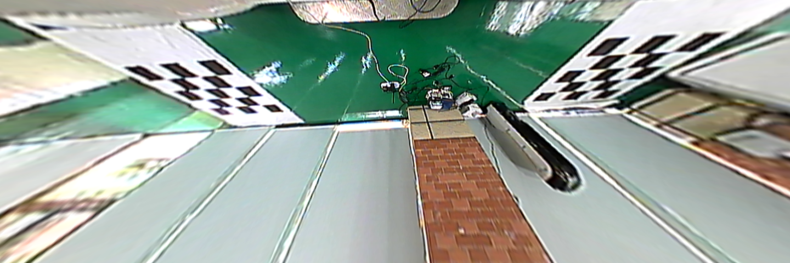
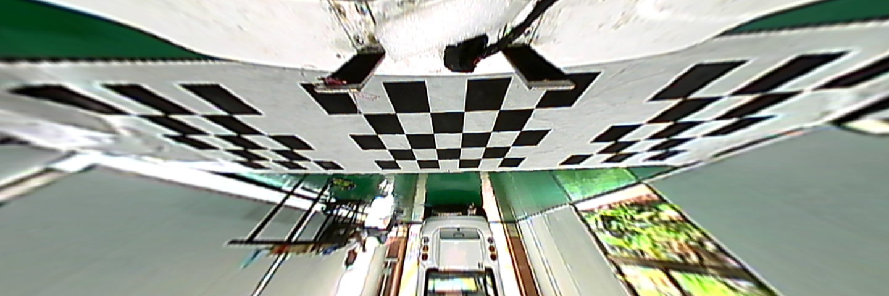
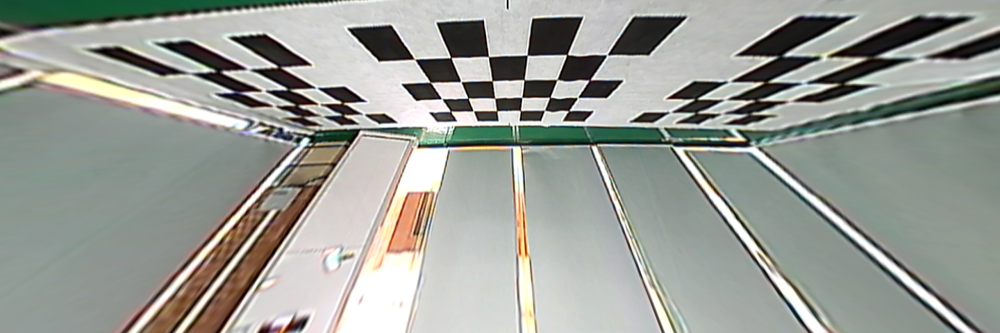
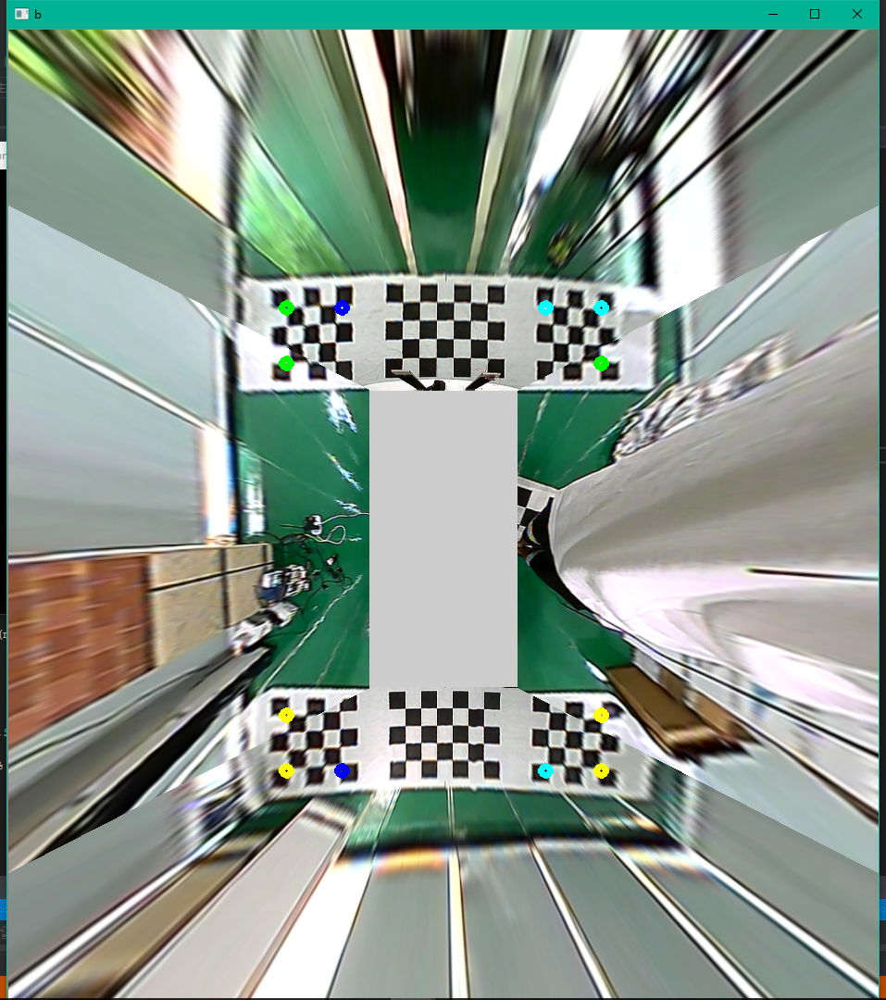

# BirdViewTransform
Put FOUR image(or video stream) from 4 different directions together, and form them into a bird view. 

## About

I have four imgs, such as(from up to down: left, forward, right, backward)

![Right][img/2.png)

using this programe, we can get

## other

Before birdEye transform, Calibrationof camera is needed! here is a [link](http://tanzby.cn/2017/08/01/%E5%9F%BA%E4%BA%8EopenCV%E7%9A%84%E7%9B%B8%E6%9C%BA%E6%A0%A1%E6%AD%A3%E7%A8%8B%E5%BA%8F/) for calibration. 
